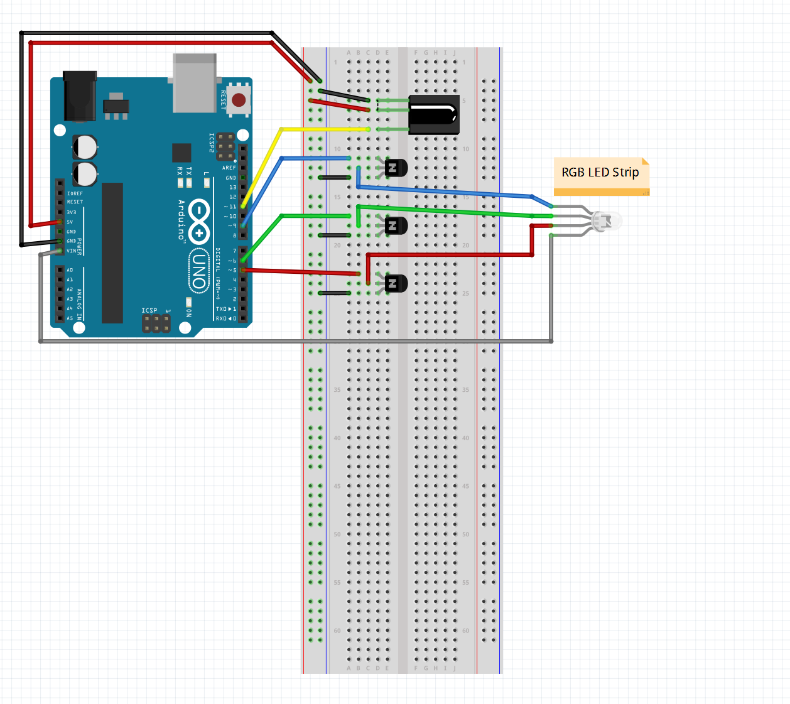

# LED-Strip

### A Remote-Controlled RGB LED Arduino program developed by [Austin Beauchamp](https://www.linkedin.com/in/austinbeauchamp).

This is basic Arduino code for controlling a 5v RGB LED strip. Although still in early stages, it can still function for turning on all the various colours with a remote and features a spectrum-cycling mode (enabling this mode requires a hard reset/power down of the Arduino to turn it off as the current loop can't accept any other button presses - but oh does it ever look pretty). Many obstacles such as overcoming controller delays to accept button pushes are being tackled - slowly but surely.

# Parts used
Following is a list of parts, and most links (some Canadian, eh). Any parts should work as long as the description match up.

* Arduino uno
* [IR Receiver](https://www.amazon.ca/SODIAL-Receiving-Infrared-VS1838B-Receiver/dp/B00ZE9UGA6/ref=sr_1_7?ie=UTF8&qid=1488780104&sr=8-7&keywords=ir+receiver)
* [IR Remote](https://www.amazon.ca/iMOBILE-Player-Transmitter-Remote-Black/dp/B0016BVDIK)
* Sound sensor (not necessary right now as music functionality  is minimal)
* [12v RGB LED Strip](https://www.amazon.ca/JOYLAND-Flexible-Lights-Non-waterproof-Multi-colors/dp/B019IYTH0M/ref=sr_1_1?s=hi&ie=UTF8&qid=1488779154&sr=1-1&keywords=JOYLAND+12V+Flexible+RGB+LED+Strip+Lights+300+Units+5050+LEDs%2C+Non-waterproof+LED+Tape+Multi-colors+LED+Strips+Light+Pack+of+16.4ft%2F5m)
* [NPN T0-220 MOSFET](https://www.amazon.ca/SODIAL-IRF3205-IRF3205PBF-Switching-Transistor/dp/B00K67YM7E/ref=sr_1_1?s=hi&ie=UTF8&qid=1488779132&sr=1-1&keywords=SODIAL%28R%29+10pc+IRF3205+IRF3205PBF+Fast+Switching+Power+Mosfet+Transistor+%2F+N+Channel+T0220)
* [12v 3A Power Brick](https://www.amazon.ca/ZOSI-2000MA-supply-camera-system/dp/B015DXJ6NU/ref=sr_1_1?s=kitchen&ie=UTF8&qid=1488779283&sr=8-1&keywords=ZOSI+DC12V+3A+2000MA+US+power+supply+for+cctv+camera+system)
* Wires

# Setup and usage

If you're even looking at this repo after checking the schematic and parts list, you probably have a decent idea of what you're doing. These steps will most likely be useless. Not many people who order transistors and a straight LED strip for their Arduino need to know how to connect their board to the computer. But nevertheless: 

Follow the schematic to connect all the components to a breadboard correctly. 

### The LED strip will require 12v, which is more than the usb can supply. 

I supply the voltage by connecting a 12v/3A wall power supply to the 2.1mm barrel jack of the Arduino and then connect it through the vin pin. It is possible to use any type of external power source, but it must be 12v to get full luminosity. 3 amps is recommended.

After installing the [Arduino IDE](https://www.arduino.cc/en/Main/Software) and downloading the main .ino file, create a directory named "LED-Strip" wherever you please. NOTE: The file MUST be in a folder named EXACTLY the same as it! This is a nit-picky arduino thing.

Connect your Arduino to the computer via usb and open the .ino file. Then in the Arduino IDE, navigate to 
  
  > Tools -> Port
  
and select the correct port for your microcontroller (mine is COM3).

Download and install your choice of [infared remote library](https://github.com/z3t0/Arduino-IRremote).

Verify and upload the code to your Arduino.

### Using the serial monitor, update the hex values labeled "const static double ..." to match whatever your remote is! Keep the '0x' in front of the values as these signify that it is a hexadecimal value.
This will determine if button presses actually trigger a response from the code. A comment saying what each button does on my setup is right next to each value. Feel free to map whatever buttons to whatever functions you want. 

Reupload the code with your new button values.

Now you should just be able to press whatever buttons you mapped earlier to control your LED strip! The next step is to wait until it's dark and admire your room's new lighting.

# TODO
Future steps for the program include
* Fixing the music responsiveness (complications with interference between LED voltage and sound sensor)
* Implement manual cycleRGB() spectrum cycle speeds
* Adding manual colour cycles
* Hiding under desk so there isn't a mess of wires on top of my computer open for the world to see

More todo's are in the .ino file
